## The Problem
In the realm of higher education, the reliance on centralized databases for student information management has led to a host of challenges. Unauthorized admissions, data manipulation, and compromised record security have become persistent issues, affecting hundreds of educational institutions annually. These vulnerabilities erode trust in admission processes and data accuracy, impacting the educational ecosystem at large. This pressing problem demands a transformative solution to ensure the integrity and security of student data, safeguarding the credibility of academic institutions and the future of students. Drawing from my personal experience as a student at the University of Indore (DAVV), where unauthorized admissions have tarnished the institution's reputation, I was inspired to create a solution that mitigates this problem and establishes a more reliable framework for student data management.

## The Solution

Our solution is a blockchain-based web application that securely stores student data, eliminating vulnerabilities associated with centralized databases. This technology ensures data transparency, tamper resistance, and reliable record-keeping, addressing the challenges of unauthorized admissions and data manipulation prevalent in conventional systems.

## Tech Stacks
### Smart Contracts
- Smartpy for Tezos contracts

### Frontend
- React
- Tailwind CSS
- Beacon SDK for Tezos wallet integration
- Taquito for Tezos contract interaction

### Backend
- Taquito for Tezos integration

## Project Demo
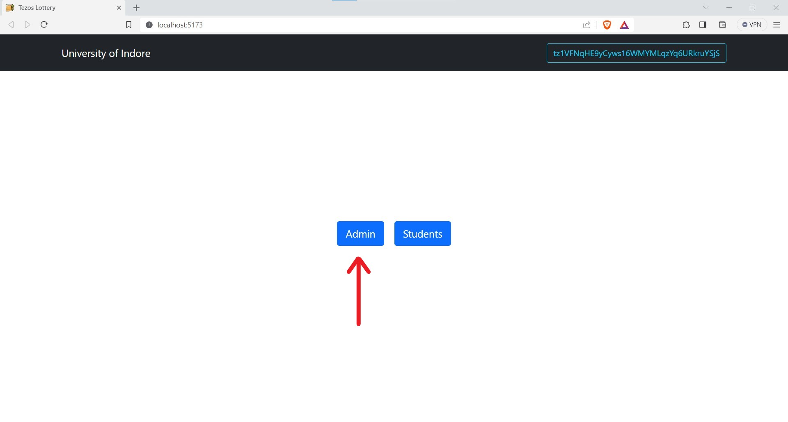
- 1 -> Since this is the First time , we need to "Open Admission". So we will go to the Admin Page.

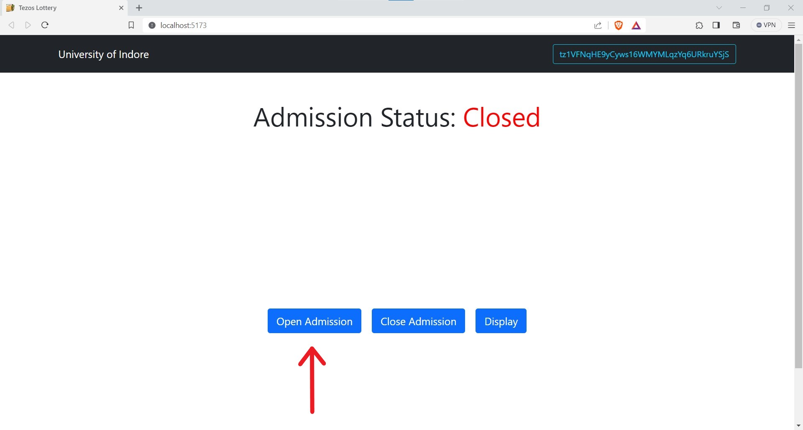
- 2 -> We can see the "Admission Status" which is "closed" , now click on "Open Admission".

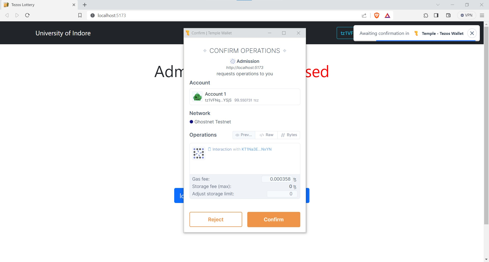
- 3 -> Since this operation is going to change the state of Blockchain , hence we need to pay some tez.

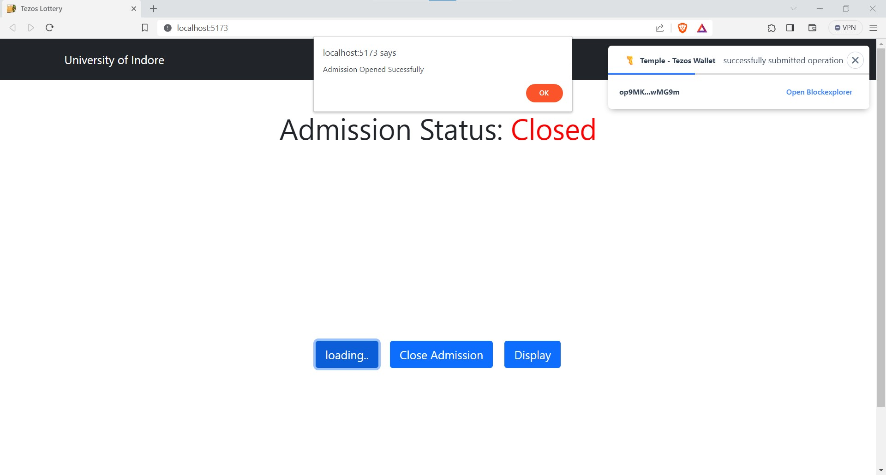 
- 4 -> Once it is done , we can see a pop up confirming the same and the status gets changed to "Open".

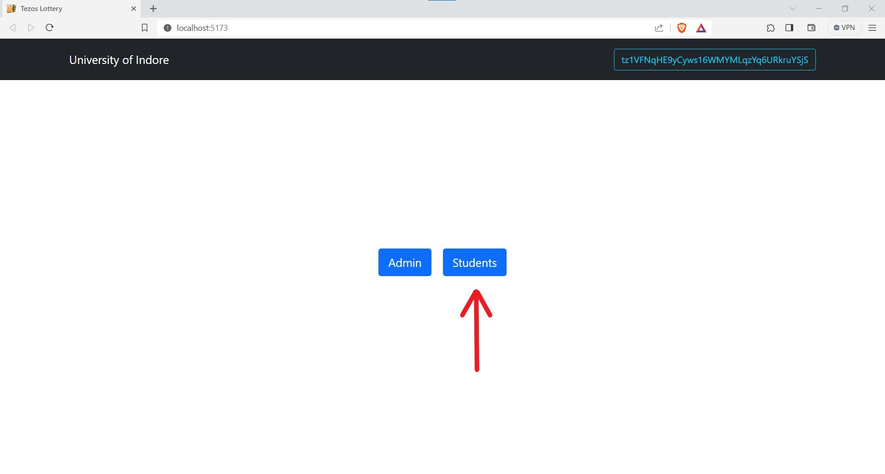
- 5 -> Now we will go to the Students section to enter the details.

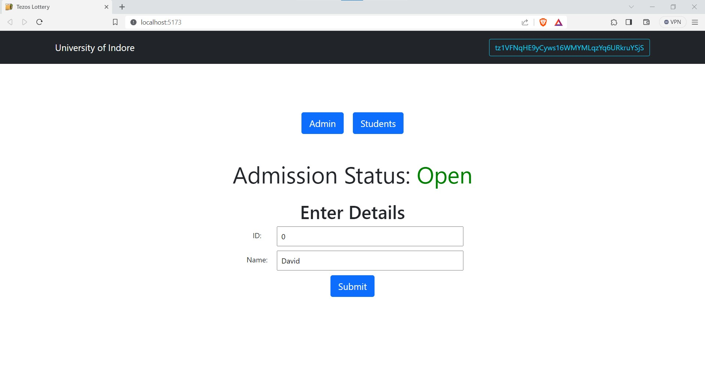
- 6 -> Enter detail in the input box and hit submit.

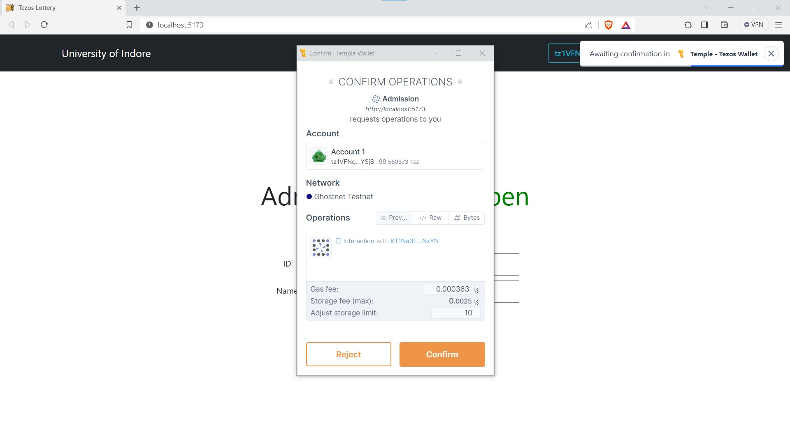
- 7 -> Since this will change the state of blockchain we need to pay some tez, this could be thought of as the admission/application fee charged by the colleges.

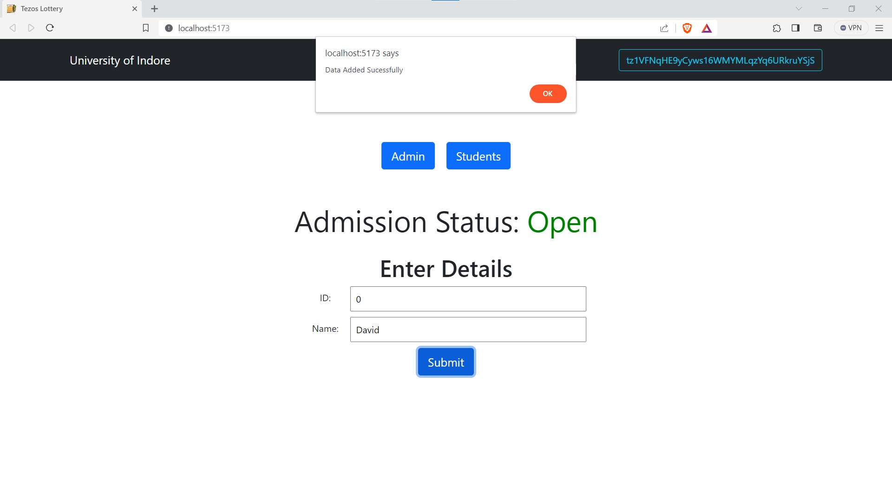
- 8 -> Once the Operation is succesfull we will get the pop up.

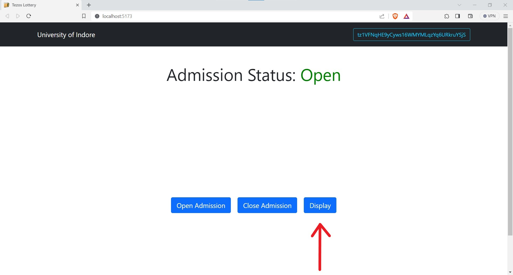 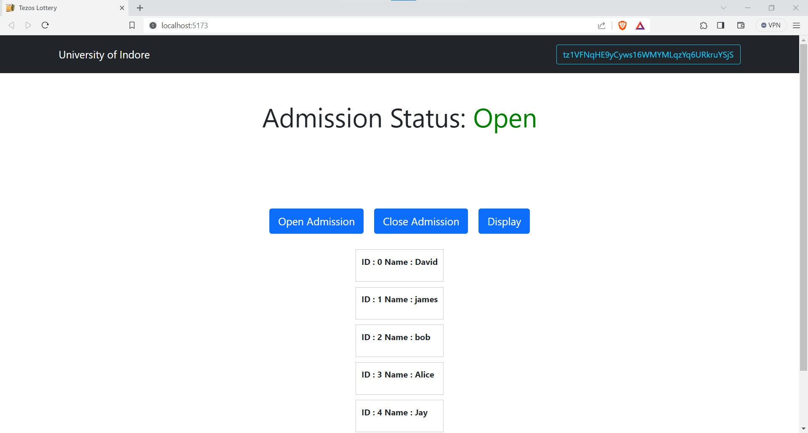
- 9 -> The Admins can retrieve the data using "Display" in the Admin page

- 10 -> Snapshot of storage.

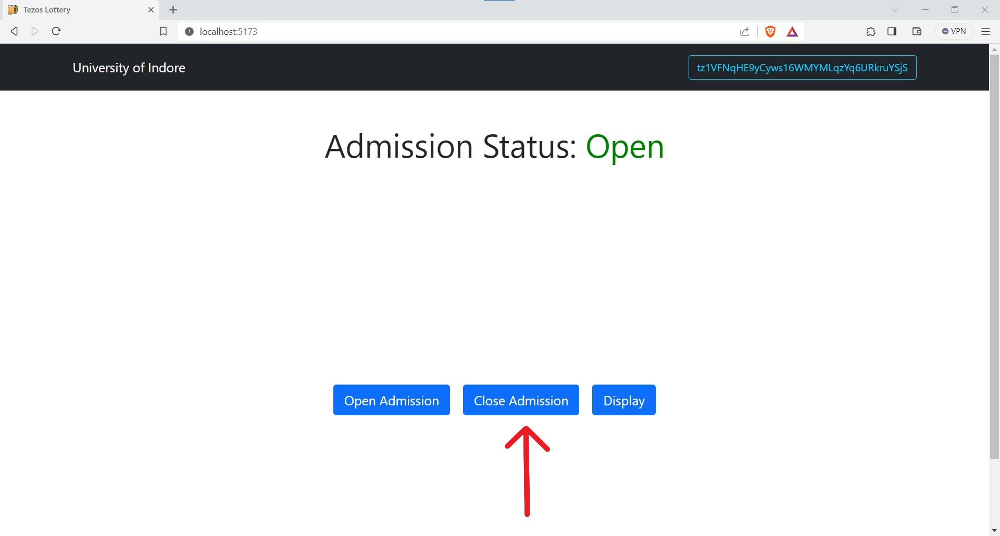 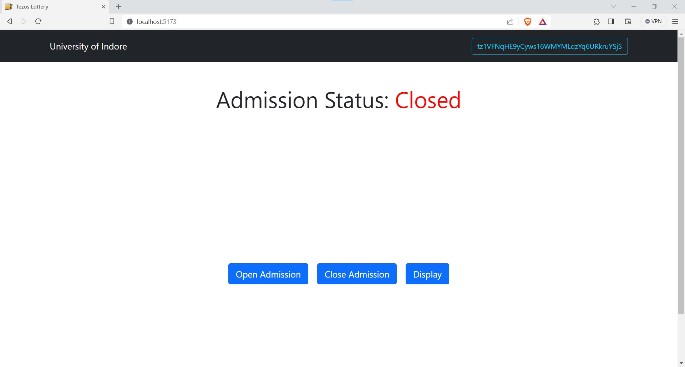
- 11 -> Once done with all the admissions , the Admin can close the admissions and now no one can manipulate the data until the portal is opened again next year by the Admin
